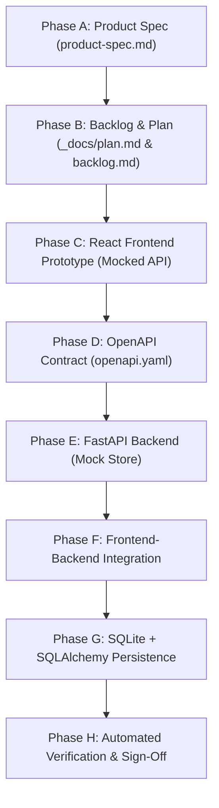
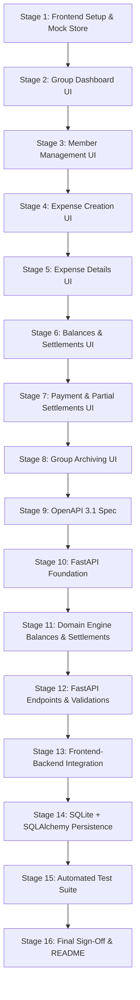
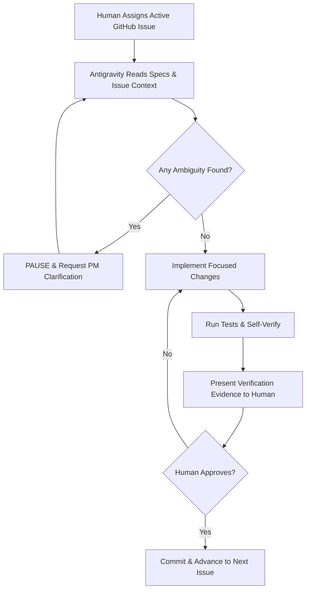

# Expense Splitter — Development Plan

**Project:** Expense Splitter (DataTalksClub AI Dev Tools Zoomcamp — Module 2)  
**Status:** Frozen / Authoritative  
**Document Version:** 1.0  
**Target Path:** `_docs/plan.md`  
**Reference Specification:** [`product-spec.md`](../product-spec.md)  
**Detailed Backlog:** [`_docs/backlog.md`](backlog.md)

---

## 1. Development Principles

This plan establishes the engineering principles and execution model for implementing the Expense Splitter according to the approved product specification ([`product-spec.md`](../product-spec.md)):

1. **Specification Before Implementation:** No code is written without an approved specification and an active task from the backlog.
2. **Small, Incremental Tasks:** Break development into small, self-contained units that can be executed, tested, and reviewed independently.
3. **Single Issue at a Time:** Work sequentially on one issue/task at a time. Do not multitask across unrelated features.
4. **Explicit Context for AI Coding Agent:** Antigravity must work from explicit references to `product-spec.md`, `_docs/backlog.md`, and the active GitHub issue.
5. **Human Review After Implementation:** Every stage must be inspected by the human engineer before considering it complete.
6. **QA Verification Before Completion:** Code must be verified against the testable Acceptance Criteria (AC) defined in the specification.
7. **Commit After Verified Work:** Work is committed to git only after passing verification. No messy multi-feature megapull requests.
8. **Avoid Speculative Features:** Strictly adhere to the locked scope. Do not invent unrequested helpers, configuration flags, or premature abstractions.
9. **Separate Frontend and Backend Concerns:** The frontend must interact exclusively with a clean API service layer; the backend exposes a clean REST interface.
10. **OpenAPI as the Source of Truth Contract:** The OpenAPI contract bridges frontend and backend, preventing drift.
11. **Mock First, Persist Later:** Build and validate the interactive UX and business logic against a centralized mock service layer before wiring real network calls and SQLite persistence.

---

## 2. Technical Stack

### Architecture Progression
```
[React + TypeScript + Vite]
            │
            ▼
[Centralized API / Service Layer] (Initially Mocked)
            │
            ▼
   [OpenAPI Contract]
            │
            ▼
    [FastAPI Backend]
            │
            ▼
 [Mock / In-Memory Store] (Initially)
            │
            ▼
  [SQLite + SQLAlchemy 2.0] (Final Persistence)
```

### Stack Components
- **Frontend:**
  - Framework: **React 18+**
  - Language: **TypeScript**
  - Tooling / Bundler: **Vite**
  - Styling: Modern clean CSS / Tailwind CSS (no heavyweight UI component libraries that hide logic)
  - HTTP Client: Fetch-based centralized service client
- **Backend:**
  - Language: **Python 3.11+**
  - Framework: **FastAPI**
  - Environment / Dependency Manager: **uv**
- **Persistence:**
  - ORM: **SQLAlchemy 2.x**
  - Database: **SQLite** (`expenses.db`)
- **API Contract:**
  - **OpenAPI 3.1** (`openapi.yaml`)
- **Testing:**
  - Backend: **pytest** + `httpx` (FastAPI TestClient)
  - Frontend: **Vitest** + React Testing Library (for core calculation and UI flows)

### Explicitly Excluded Technologies (HW2 Guardrails)
- ❌ No Docker or Docker Compose
- ❌ No CI/CD pipelines (GitHub Actions reserved for later)
- ❌ No Redis, Celery, or background worker queues
- ❌ No WebSockets
- ❌ No Authentication libraries (Auth0, JWT, Passlib, OAuth2)
- ❌ No Cloud SDKs (AWS, GCP, Azure)

---

## 3. Proposed Repository Structure

```
expense-splitter/
├── product-spec.md               # Authoritative Product Specification
├── AGENTS.md                     # Agent operating rules and scope boundaries
├── README.md                     # Project overview and documentation links
├── .gitignore                    # Standard ignore configuration
├── _docs/
│   ├── plan.md                   # Authoritative Development Plan (Strategy & Sequencing)
│   └── backlog.md                # Detailed Actionable Backlog (16 Planned Issues)
├── openapi.yaml                  # Canonical OpenAPI 3.1 Contract (Phase D - planned)
├── frontend/                     # React + TypeScript + Vite App (Phase C - planned)
│   ├── index.html
│   ├── package.json
│   ├── tsconfig.json
│   ├── vite.config.ts
│   └── src/
│       ├── main.tsx
│       ├── App.tsx
│       ├── types/                # Domain & API types
│       ├── services/             # Centralized API service layer (mock vs live)
│       ├── components/           # Modular UI Components
│       └── utils/                # Rounding & calculation helpers
└── backend/                      # FastAPI Python Application (Phase E - planned)
    ├── pyproject.toml            # uv project configuration
    ├── app/
    │   ├── main.py               # FastAPI entrypoint
    │   ├── models/               # SQLAlchemy DB Models (Phase G - planned)
    │   ├── schemas/              # Pydantic Schemas
    │   ├── domain/               # Pure calculation engine
    │   └── api/                  # Route handlers
    └── tests/                    # Backend pytest suite
```

---

## 4. Course-Aligned Development Sequence & Stages

The project executes across **8 sequential phases (Phase A through Phase H)** broken down into **16 discrete, manageable implementation stages**:



---

### Phase A: Specification (Completed)
- **Status:** Done. Authoritative document locked at [`product-spec.md`](../product-spec.md).

---

### Phase B: Development Backlog & Technical Planning (Current)
- **Status:** Active. Development plan locked at `_docs/plan.md` with detailed actionable work items in [`_docs/backlog.md`](backlog.md).

---

### Phase C: React Frontend Prototype (Mocked Service Layer)

#### Stage 1: Frontend Workspace Foundation & Centralized Mock Service
- **Objective:** Scaffold the Vite + React + TypeScript application with a centralized mock API service layer.
- **Scope:** Initialize `frontend/`, configure TypeScript, define TypeScript domain interfaces matching `product-spec.md`, and create `src/services/mockStore.ts` pre-seeded with sample groups, members, and expenses.
- **Dependencies:** Phase A & B.
- **Verification:** `npm run dev` serves the app without errors; TypeScript compiles cleanly.
- **Non-Goals:** Real HTTP network calls; backend code.

#### Stage 2: Group Dashboard & Multi-Group Navigation UI
- **Objective:** Enable users to view, create, and switch between groups.
- **Scope:** Build group listing page, "Create New Group" modal (name + currency selection), and store recent group IDs in browser `localStorage`.
- **Dependencies:** Stage 1.
- **Verification:** User can create a group with currency (e.g., INR) and see it listed; direct URL navigation (`/groups/{id}`) loads the group context.
- **Non-Goals:** Expense/payment manipulation.

#### Stage 3: Member Management UI
- **Objective:** Allow viewing, adding, and safely deleting group members.
- **Scope:** Member list panel, "Add Member" form, and "Delete Member" action enforcing the zero-history rule (disabling/blocking deletion if member is referenced).
- **Dependencies:** Stage 2.
- **Verification:** User can add "Alice" and "Bob"; deleting unreferenced "Bob" succeeds; deleting a referenced member fails with validation UI.
- **Non-Goals:** Complex user avatars or account profiles.

#### Stage 4: Expense Creation & Editing UI (Equal & Exact Splits)
- **Objective:** Form interface for logging and modifying single-payer expenses.
- **Scope:** Create/edit expense modal: title, amount, payer dropdown, participant checkboxes, split method toggle (`EQUAL` vs `EXACT`), date picker, optional notes.
- **Validation:** Enforce deterministic cent distribution on EQUAL splits; enforce $\sum \text{shares} == \text{amount}$ on EXACT splits.
- **Dependencies:** Stage 3.
- **Verification:** Creating ₹100.00 equal split for 3 people distributes ₹33.34 / ₹33.33 / ₹33.33. Editing an expense updates the mock store.
- **Non-Goals:** Receipt image upload; percentage splits.

#### Stage 5: Expense History & Details UI
- **Objective:** Display chronological list of group expenses with breakdown inspection.
- **Scope:** Card/table view showing expense title, payer, date, total amount, participant tags, and edit/delete action triggers.
- **Dependencies:** Stage 4.
- **Verification:** Expenses render correctly; deleting an expense removes it from the list.
- **Non-Goals:** Search/filter by advanced criteria.

#### Stage 6: Derived Balances & Settlement Suggestions UI
- **Objective:** Display real-time net balances and calculated debt simplification suggestions.
- **Scope:** 
  - Net balance cards for each member (color-coded: green for creditor, red for debtor, gray for settled).
  - "Who Owes Whom" simplified settlement card showing recommended payments.
- **Dependencies:** Stage 5.
- **Verification:** Verify with AC-S1 (Alice +100, Bob +50, Charlie -150 displays: Charlie pays Alice 100, Charlie pays Bob 50).
- **Non-Goals:** Payment submission form (handled in Stage 7).

#### Stage 7: Payment Recording & Partial Settlements UI
- **Objective:** Allow members to record settlement payments against the suggested plan.
- **Scope:**
  - "Record Payment" action button attached to settlement suggestion items.
  - Payment modal pre-filled with suggested payer, recipient, and max amount.
  - Support full or partial payment entry.
  - Payment history list showing recorded cash transfers.
- **Validation:** Block payments exceeding the suggested amount; block payments to non-creditors.
- **Dependencies:** Stage 6.
- **Verification:** Recording ₹40 payment against ₹100 suggestion reduces remaining suggestion to ₹60 and updates net balances.
- **Non-Goals:** External banking/gateway redirection.

#### Stage 8: Group Archiving & Reopening Lifecycle UI
- **Objective:** Support group closure and read-only status enforcement.
- **Scope:**
  - "Archive Group" button: disabled/blocked with warning if any member balance $\neq 0.00$.
  - Archived view: displays "ARCHIVED" banner, hides/disables all edit/create/delete buttons.
  - "Reopen Group" button: restores group to `ACTIVE` and re-enables mutations.
- **Dependencies:** Stage 7.
- **Verification:** Attempting archive at non-zero balance fails; archiving at ₹0.00 locks UI; reopening unlocks UI.
- **Non-Goals:** Permanent database drop/deletion.

---

### Phase D: OpenAPI Contract

#### Stage 9: Canonical OpenAPI 3.1 Specification (`openapi.yaml`)
- **Objective:** Formalize the complete HTTP REST contract based on validated frontend mock requirements.
- **Scope:** Create `openapi.yaml` documenting all endpoints, schemas, parameters, response codes, and error models:
  - `/groups`, `/groups/{id}`
  - `/groups/{id}/members`, `/groups/{id}/members/{member_id}`
  - `/groups/{id}/expenses`, `/groups/{id}/expenses/{expense_id}`
  - `/groups/{id}/payments`
  - `/groups/{id}/balances` (derived)
  - `/groups/{id}/settlements` (derived)
  - `/groups/{id}/archive`, `/groups/{id}/reopen`
- **Dependencies:** Phase C (all frontend mock contracts verified).
- **Verification:** `openapi.yaml` validates against standard OpenAPI 3.1 linter.
- **Non-Goals:** Backend implementation code.

---

### Phase E: FastAPI Backend (Mock / In-Memory Store)

#### Stage 10: FastAPI Foundation & In-Memory Store
- **Objective:** Initialize Python FastAPI project using `uv` with in-memory state repository.
- **Scope:** Set up `backend/pyproject.toml`, FastAPI app instance, CORS middleware allowing frontend origin, and thread-safe in-memory store mirroring the OpenAPI schema.
- **Dependencies:** Stage 9.
- **Verification:** `uv run uvicorn app.main:app --reload` runs; `/docs` renders Swagger UI matching `openapi.yaml`.
- **Non-Goals:** SQLAlchemy ORM; SQLite database file.

#### Stage 11: Pure Domain Calculation Engine (Balances & Settlements)
- **Objective:** Implement pure, isolated Python business logic functions for net balance computation and debt simplification.
- **Scope:**
  - `calculate_net_balances(expenses, payments)`: Computes member balances ($\sum = 0.00$).
  - `calculate_simplified_settlements(net_balances)`: Matches net debtors with net creditors, eliminating unnecessary intermediate transactions and settling all non-zero balances in $\le N-1$ transactions (no global optimization algorithm required).
  - `allocate_equal_shares(total_cents, participant_ids)`: Deterministic sequential penny remainder allocation.
- **Dependencies:** Stage 10.
- **Verification:** Standalone unit tests (`pytest`) verifying AC-01 through AC-05 with zero failures.
- **Non-Goals:** HTTP route wiring.

#### Stage 12: FastAPI Route Handlers & Validation Logic
- **Objective:** Implement REST endpoints in FastAPI backed by the domain engine and in-memory store.
- **Scope:** Route handlers for groups, members, expenses, payments, settlements, and lifecycle actions. Enforce all validation rules:
  - 400 on negative/zero amounts.
  - 400 on exact split mismatches.
  - 400 on payments exceeding suggested settlement.
  - 400 on deleting member with financial history.
  - 400 on archiving group with non-zero balances.
  - 403 on mutating archived group.
- **Dependencies:** Stage 11.
- **Verification:** Automated API integration tests (`test_api_endpoints.py`) using `httpx.AsyncClient`.
- **Non-Goals:** SQLite persistence.

---

### Phase F: Frontend / Backend Integration

#### Stage 13: Wire React Frontend to FastAPI Backend
- **Objective:** Switch frontend centralized API layer from `mockStore.ts` to live `httpClient.ts`.
- **Scope:** Implement real `fetch` client in `frontend/src/services/httpClient.ts`, point requests to FastAPI server (`http://localhost:8000`), handle HTTP error payloads, and surface validation messages in the UI.
- **Dependencies:** Stage 12.
- **Verification:** Full end-to-end user journey executed in browser against running FastAPI server: create group $\to$ add members $\to$ log expenses $\to$ record payments $\to$ archive group.
- **Non-Goals:** Database migrations.

---

### Phase G: SQLite + SQLAlchemy Persistence

#### Stage 14: SQLAlchemy Models, Migrations & SQLite Persistence Layer
- **Objective:** Replace in-memory repository with persistent SQLite database via SQLAlchemy 2.0.
- **Scope:**
  - Define SQLAlchemy ORM models: `GroupModel`, `MemberModel`, `ExpenseModel`, `ExpenseShareModel`, `PaymentModel`.
  - Configure SQLite database engine with foreign key support enabled (`PRAGMA foreign_keys=ON`).
  - Update route handlers/repositories to commit to SQLite.
- **Dependencies:** Stage 13.
- **Verification:** Restarting FastAPI server preserves all existing groups, expenses, and payments.
- **Non-Goals:** Multi-tenant PostgreSQL or cloud databases.

---

### Phase H: Automated Verification & Project Sign-Off

#### Stage 15: Comprehensive Test Suite Execution
- **Objective:** Execute full automated test suite across frontend and backend.
- **Scope:**
  - Backend: Run full `pytest` suite testing all domain rules, edge cases (EC-01 to EC-15), and endpoint contracts.
  - Frontend: Run `vitest` suite for UI calculation utilities and core component interactions.
- **Dependencies:** Stage 14.
- **Verification:** 100% passing tests with zero regressions.
- **Non-Goals:** Flaky end-to-end browser automation suites.

#### Stage 16: Final Acceptance Criteria Sign-Off & Documentation
- **Objective:** Perform manual walk-through against all Acceptance Criteria (AC-G1 through AC-A4 in `_docs/specs.md`) and finalize project documentation.
- **Scope:** Produce verification log confirming compliance with every requirement, update `README.md` with setup/run instructions.
- **Dependencies:** Stage 15.
- **Verification:** Final human PM/QA sign-off.

---

## 5. Dependencies & Critical Path



### Parallel Track Opportunities
- Once Stage 9 (OpenAPI Spec) is approved, backend domain engine development (Stage 11) can begin immediately while frontend refinements continue.
- Writing test cases for domain calculations (Stage 11) proceeds directly from formulas in [`product-spec.md`](../product-spec.md) before API routes are wired.

---

## 6. Verification Strategy

Every stage follows a rigorous verification cycle before code is committed:

```
[Write Code for Single Stage]
              │
              ▼
    [Run Automated Tests]
   (pytest / vitest / typecheck)
              │
              ▼
   [Manual Verification]
 (Check UI flow / Swagger docs)
              │
              ▼
[Compare Against Acceptance Criteria]
              │
              ▼
    [Human Review Gate]
              │
              ▼
     [Git Commit Stage]
```

### Verification Requirements:
1. **Type Checking:** Zero TypeScript (`tsc --noEmit`) and Python type/lint errors.
2. **Deterministic Penny Check:** Explicit assertion that sum of participant shares equals total amount for any split test.
3. **Immutability Check:** Verification that expense edits do not mutate historical payment IDs or amounts.
4. **Lifecycle Lock Check:** Verification that archiving returns 403 on mutation attempts and 400 on non-zero balances.

---

## 7. GitHub Issue Backlog Summary (Planned)

The 16 planned implementation issues below correspond directly to Stages 1–16. For complete issue specifications, scopes, acceptance criteria, and non-goals, refer to the authoritative [`_docs/backlog.md`](backlog.md).

| Issue # | Title | Phase | Primary Scope | Detailed Spec |
| :--- | :--- | :--- | :--- | :--- |
| **#1** | `feat(frontend): scaffold React + TS + Vite app with mock service layer` | Phase C | Initial project, types, mock store | [backlog.md#issue-1](backlog.md#issue-1-scaffold-react--ts--vite-application-with-mock-service-layer) |
| **#2** | `feat(frontend): implement group dashboard and local navigation` | Phase C | Group list, group create modal, local storage | [backlog.md#issue-2](backlog.md#issue-2-implement-group-dashboard-and-local-navigation) |
| **#3** | `feat(frontend): implement member management with zero-history safety` | Phase C | Add member, delete unreferenced member | [backlog.md#issue-3](backlog.md#issue-3-implement-member-management-with-zero-history-safety) |
| **#4** | `feat(frontend): implement expense creation with equal and exact splits` | Phase C | Expense modal, cent remainder allocator, exact validation | [backlog.md#issue-4](backlog.md#issue-4-implement-expense-creation-with-equal-and-exact-splits) |
| **#5** | `feat(frontend): implement expense list and details view` | Phase C | Expense cards, edit/delete triggers | [backlog.md#issue-5](backlog.md#issue-5-implement-expense-list-editing-and-deletion-view) |
| **#6** | `feat(frontend): implement live net balance and settlement suggestions UI` | Phase C | Derived balances display, debt simplification cards | [backlog.md#issue-6](backlog.md#issue-6-implement-live-net-balance-and-settlement-suggestions-ui) |
| **#7** | `feat(frontend): implement payment recording and partial settlement UI` | Phase C | Payment modal, plan validation gate, payment history | [backlog.md#issue-7](backlog.md#issue-7-implement-payment-recording-and-partial-settlement-ui) |
| **#8** | `feat(frontend): implement group archiving and reopening lifecycle` | Phase C | Zero-balance archive check, read-only view, reopen | [backlog.md#issue-8](backlog.md#issue-8-implement-group-archiving-and-reopening-lifecycle-ui) |
| **#9** | `feat(api): define canonical OpenAPI 3.1 specification` | Phase D | `openapi.yaml` contract for all routes & schemas | [backlog.md#issue-9](backlog.md#issue-9-define-canonical-openapi-31-specification) |
| **#10** | `feat(backend): scaffold FastAPI project with in-memory store` | Phase E | FastAPI app, uv setup, CORS, in-memory repository | [backlog.md#issue-10](backlog.md#issue-10-scaffold-fastapi-project-with-in-memory-repository) |
| **#11** | `feat(backend): implement domain calculation engine with unit tests` | Phase E | Pure functions: balances, greedy settlements, rounding | [backlog.md#issue-11](backlog.md#issue-11-implement-domain-calculation-engine-with-unit-tests) |
| **#12** | `feat(backend): implement FastAPI endpoints with domain validations` | Phase E | Group, member, expense, payment routes + error codes | [backlog.md#issue-12](backlog.md#issue-12-implement-fastapi-endpoints-with-domain-validations) |
| **#13** | `feat(integration): connect React frontend to live FastAPI backend` | Phase F | Switch service layer to HTTP client, error propagation | [backlog.md#issue-13](backlog.md#issue-13-connect-react-frontend-to-live-fastapi-backend) |
| **#14** | `feat(persistence): implement SQLite persistence via SQLAlchemy 2.0` | Phase G | ORM models, foreign keys, database session lifecycle | [backlog.md#issue-14](backlog.md#issue-14-implement-sqlite-persistence-via-sqlalchemy-20) |
| **#15** | `test: execute comprehensive test suite for frontend and backend` | Phase H | End-to-end API tests, edge case verification | [backlog.md#issue-15](backlog.md#issue-15-execute-comprehensive-test-suite-for-frontend-and-backend) |
| **#16** | `docs: complete final acceptance criteria sign-off and README` | Phase H | Manual AC walk-through, setup documentation | [backlog.md#issue-16](backlog.md#issue-16-complete-acceptance-criteria-walkthrough-and-project-documentation) |

---

## 8. AI Agent (Antigravity) Workflow

To maintain code quality and prevent scope creep, Antigravity adheres to this explicit protocol:



### Agent Rules:
1. **Never Expand Scope:** Do not add fields, dependencies, or endpoints not defined in [`product-spec.md`](../product-spec.md), [`_docs/backlog.md`](backlog.md), or the active issue.
2. **Never Silently Resolve Financial Tensions:** If a calculation ambiguity arises, halt and request human clarification.
3. **Self-Contained Commits:** Keep diffs minimal, clean, and directly tied to the active issue.

---

## 9. Definition of Done (DoD)

An issue or stage is declared **DONE** only when all of the following criteria are satisfied:

1. **Specification Alignment:** Implementation strictly satisfies the requirements in [`product-spec.md`](../product-spec.md).
2. **Acceptance Criteria Pass:** All relevant Acceptance Criteria (AC-G1 through AC-A4) pass verification.
3. **Zero Test Regressions:** All existing and newly introduced unit/integration tests pass.
4. **Type Safety & Lint Cleanliness:** No TypeScript compiler errors (`tsc`) and clean Python linting.
5. **No Speculative Code:** No unused dependencies, dead code, or unrequested features.
6. **Manual Verification:** Interactive functionality is manually verified in the browser or via Swagger docs.
7. **Human Approval:** Human review confirms implementation matches intent.
8. **Committed Cleanly:** Changes are committed to git with a clear, conventional commit message referencing the issue.
