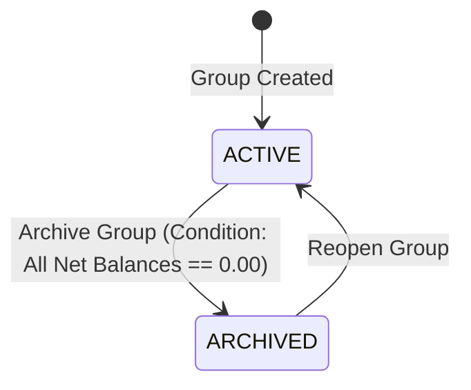

# Expense Splitter — Product Specification

**Project:** Expense Splitter (DataTalksClub AI Dev Tools Zoomcamp — Module 2)  
**Status:** Frozen / Authoritative  
**Document Version:** 1.0  
**Target Path:** `product-spec.md`

---

## 1. Product Overview

The **Expense Splitter** is a lightweight, web-based shared expense tracker designed for groups of friends, colleagues, or flatmates managing shared costs during finite events (such as trips, dinners, or group activities).

The application acts as a shared ledger where members log expenses, the system maintains real-time net balances, and a debt simplification engine generates a simplified settlement plan by matching net debtors with net creditors, eliminating unnecessary intermediate transactions. It provides a frictionless, link-based access model with no user authentication or password management required.

---

## 2. Problem Statement

Shared social events involve frequent, asymmetric expenditures: one person pays for dinner, another covers fuel, a third buys tickets for a subset of the group. Manually tracking individual IOUs across multiple people is tedious, error-prone, and socially awkward.

Existing solutions often introduce friction through mandatory account creation, email invitations, mobile-only apps, or confusing multi-currency settings. The Expense Splitter solves this by providing:
- Instant group creation and URL sharing without login gates.
- Flexible splitting (equal division and exact amounts).
- Deterministic penny-rounding ensuring zero balance leakage.
- Automated debt simplification matching net debtors with net creditors to eliminate unnecessary intermediate transactions (using no more than $N-1$ transactions for $N$ members with non-zero balances).
- Clear event lifecycle management (active tracking through full settlement and archiving).

---

## 3. Target Users & Usage Model

### Target User
Friends, roommates, travel companions, or colleagues who need to split expenses during a defined group event without setting up accounts or installing native apps.

### Usage Model
- **Device Support:** Responsive web browser (desktop and mobile viewport).
- **Lifecycle Scope:** Finite events (trips, outings, weekends) that start active, accumulate expenses and settlement payments, reach zero balance, and are archived.
- **Tenancy:** Multi-group dashboard per browser session, tracking multiple distinct groups via direct link or local session listing.

---

## 4. Groups

### Definition
A **Group** represents a discrete event, trip, or project with its own isolated ledger of members, expenses, payments, and settlements.

### Attributes
- `id`: Unique identifier (UUID or unique slug for link-based URL access).
- `name`: Human-readable name (e.g., "Goa Roadtrip", "Apartment Utilities").
- `currency`: Group-level ISO currency code or symbol (e.g., `INR`, `USD`, `EUR`). All expenses and payments within the group use this currency.
- `status`: Current lifecycle state (`ACTIVE` or `ARCHIVED`).
- `created_at`: Timestamp of group creation.

### Invariants
- A group must have a non-empty name upon creation.
- A group currency is selected upon creation and remains immutable for the lifetime of the group.

---

## 5. Group Lifecycle

The group operates as a two-state finite state machine:

1. **ACTIVE:**
   - Members can be added or deleted (if unreferenced).
   - Expenses can be created, edited, and deleted.
   - Payments can be recorded and deleted.
   - Net balances and settlement suggestions update dynamically.
   - Archiving is blocked if any member has a non-zero net balance ($\neq 0.00$).

2. **ARCHIVED:**
   - Group state is strictly **read-only**.
   - All financial and member mutations (`POST`, `PUT`, `DELETE` on expenses, payments, members) are rejected.
   - Members, expenses, payments, net balances, and settlement history remain visible.
   - The group can be transitioned back to `ACTIVE` by clicking **Reopen Group**.

---

## 6. Member Model

### Definition
A **Member** represents a named participant within a specific group. Members are placeholder nicknames/names and are **not** linked to global user accounts.

### Attributes
- `id`: Unique identifier within the group.
- `group_id`: Identifier of the group this member belongs to.
- `name`: Display name/nickname (e.g., "Alice", "Bob"). Must be non-empty and unique within the group.
- `created_at`: Timestamp of member addition.

### Rules & Invariants
- **Scope:** Members exist only in the context of their specific group.
- **Referential Integrity (Zero-History Rule):**
  - A member may be deleted **if and only if** they have zero financial references:
    - Never designated as the payer of any expense.
    - Never included as a participant in any expense.
    - Never recorded as the payer of any payment.
    - Never recorded as the recipient of any payment.
  - If a member is referenced by any existing expense or payment, deletion is **strictly blocked** with a validation error.

---

## 7. Access Model

- **No Authentication / Link-Based:** The application does not require user accounts, passwords, email verification, or session tokens.
- **Group URLs:** Access to a group is granted via its unique URL/identifier (e.g., `/groups/{group_id}`).
- **Multi-Group Navigation:** The frontend dashboard maintains a list of recently created or visited groups in browser storage (LocalStorage), enabling users to navigate between multiple active groups.

---

## 8. Currency Model

- **Group-Level Single Currency:** Each group selects a single currency at creation time (e.g., INR ₹, USD $, EUR €).
- **Uniformity:** All expenses and payments recorded in that group implicitly use that group's currency.
- **No Exchange Rates:** Multi-currency conversions, foreign exchange rates, and mixed-currency expenses are strictly **Out of Scope**.
- **Precision:** All monetary calculations and persistence use 2-decimal precision (cents/paise).

---

## 9. Expense Model (Source Data)

### Definition
An **Expense** is a historical source record documenting a real-world expenditure paid by one member for one or more participants.

### Attributes
- `id`: Unique identifier.
- `group_id`: Group identifier.
- `title`: Short description of what was purchased (e.g., "Dinner at Bistro").
- `amount`: Total amount paid. Must be strictly positive ($> 0.00$).
- `payer_id`: Identifier of the member who paid. Exactly one payer per expense.
- `split_method`: `EQUAL` or `EXACT`.
- `expense_date`: Date the expense occurred (defaults to current date, editable).
- `notes`: Optional textual context (max 255 characters).
- `created_at`: Creation timestamp.
- `updated_at`: Last modification timestamp.

---

## 10. Participants & Shares (Source Data)

### Definition
A participant is a group member who shares responsibility for a portion of an expense.

### Attributes (per participant share)
- `expense_id`: Reference to parent expense.
- `member_id`: Reference to group member.
- `owed_amount`: Exact monetary share owed by this member for this expense.

### Rules
- **Subset Selection:** Any non-empty subset of group members can participate in an expense ($\ge 1$ participant).
- **Payer Participation:** The payer **does not** have to be a participant. For example:
  - *Alice pays ₹300 for Bob and Charlie (Alice excluded):* Valid. Bob owes ₹150, Charlie owes ₹150, Alice paid ₹300, owes ₹0.
  - *Alice pays ₹300 for Alice only:* Valid (net debt impact is ₹0).
- **Sum Completeness:** The sum of all participant shares must strictly equal the total expense amount.

---

## 11. Split Methods

The application supports two split methods:

### A. EQUAL Split
- The total expense amount is divided equally among all selected participants.
- If the total does not divide evenly into 2-decimal amounts, the system applies **deterministic sequential penny remainder allocation** (see Section 12).

### B. EXACT Split
- The user explicitly inputs the exact monetary amount owed by each selected participant.
- **Validation Rule:** The sum of individual participant amounts must exactly equal the total expense amount. If $\sum \text{shares} \neq \text{amount}$, the expense submission is rejected with an error displaying the discrepancy.

---

## 12. Rounding Rules & Remainder Allocation

When dividing currency with 2-decimal precision, fractional cents/paise are handled deterministically:

1. **Base Share Calculation:**
   $$\text{base\_cents} = \lfloor (\text{total\_cents}) / N \rfloor$$
2. **Remainder Calculation:**
   $$\text{remainder\_cents} = \text{total\_cents} - (\text{base\_cents} \times N)$$
3. **Sequential Remainder Distribution:**
   The remainder cents are allocated $+0.01$ (1 cent) sequentially to the first $\text{remainder\_cents}$ participants in stable participant-list order.

### Example
Expense: ₹100.00 split EQUAL among 3 participants [Alice, Bob, Charlie]:
- Total: 10,000 paise.
- $10,000 / 3 = 3,333$ paise base (₹33.33 each).
- Remainder = $10,000 - 9,999 = 1$ paisa.
- First participant (Alice) receives the extra 1 paisa.
- **Result:** Alice: ₹33.34, Bob: ₹33.33, Charlie: ₹33.33.
- **Invariant:** $33.34 + 33.33 + 33.33 = 100.00$ exactly. Zero rounding drift.

---

## 13. Expense Metadata

| Field | Requirement Level | Constraints |
| :--- | :--- | :--- |
| `amount` | **Must-Have** | Number $> 0.00$, max 2 decimal places. |
| `title` | **Must-Have** | String, 1–100 characters, non-empty. |
| `payer` | **Must-Have** | Valid existing member of group. |
| `participants` | **Must-Have** | $\ge 1$ valid existing members of group. |
| `split_method` | **Must-Have** | Enum: `EQUAL`, `EXACT`. |
| `expense_date` | **Must-Have** | Valid ISO date (`YYYY-MM-DD`). Defaults to today. |
| `notes` | **Nice-to-Have** | Optional string, max 255 characters. |
| `category` | **Nice-to-Have** | Optional tag (e.g., Food, Transport, Lodging, Entertainment). |
| `receipt_image` | **Out of Scope** | Strictly excluded. |

---

## 14. Net Balance Calculation (Derived Data)

Net balances are **derived data**, calculated deterministically from active expenses and payments. The system does not maintain mutable running balance columns.

### Formulas for Member $M$:
- **Expenses Paid ($EP_M$):**
  $$EP_M = \sum_{\substack{e \in \text{Expenses} \\ e.\text{payer} = M}} e.\text{amount}$$
- **Expenses Owed ($EO_M$):**
  $$EO_M = \sum_{\substack{s \in \text{ExpenseShares} \\ s.\text{member} = M}} s.\text{owed\_amount}$$
- **Payments Sent ($PS_M$):**
  $$PS_M = \sum_{\substack{p \in \text{Payments} \\ p.\text{payer} = M}} p.\text{amount}$$
- **Payments Received ($PR_M$):**
  $$PR_M = \sum_{\substack{p \in \text{Payments} \\ p.\text{recipient} = M}} p.\text{amount}$$

### Net Balance Formula:
$$\text{Net Balance}(M) = (EP_M + PS_M) - (EO_M + PR_M)$$

### Interpretation:
- **Net $> 0.00$ (Creditor):** The group owes this member money.
- **Net $< 0.00$ (Debtor):** This member owes money to the group.
- **Net $== 0.00$ (Settled):** This member neither owes nor is owed money.
- **Global Invariant:** $\sum_{M} \text{Net Balance}(M) = 0.00$ at all times.

---

## 15. Debt Simplification (Derived Data)

### Definition
The system generates a simplified settlement plan by matching net debtors with net creditors, eliminating unnecessary intermediate transactions. The resulting plan should settle all non-zero net balances and use no more than N-1 transactions for N participating members with non-zero balances.

> [!NOTE]
> A globally optimal minimum-transaction algorithm is explicitly **not** required. A straightforward heuristic (such as greedy debtor-creditor matching) that settles all non-zero balances within $N-1$ transactions is standard and sufficient.

### Operational Mechanism (Debtor-Creditor Matching):
1. Compute $\text{Net Balance}(M)$ for all group members.
2. Partition members with non-zero balances into:
   - **Debtors:** Members with $\text{Net} < 0.00$.
   - **Creditors:** Members with $\text{Net} > 0.00$.
3. Sort Debtors by debt magnitude descending and Creditors by credit magnitude descending.
4. Repeatedly match the top Debtor $D$ with the top Creditor $C$:
   - $\text{Transfer Amount} = \min(| \text{Net}(D) |, \text{Net}(C))$
   - Generate recommendation: **$D$ pays $C$ Transfer Amount**.
   - Adjust remaining balance: $\text{Net}(D) \leftarrow \text{Net}(D) + \text{Transfer Amount}$; $\text{Net}(C) \leftarrow \text{Net}(C) - \text{Transfer Amount}$.
   - Remove any member whose adjusted net reaches $0.00$.
5. Terminate when all non-zero net balances are settled to $0.00$.

### Invariants:
- Settle all non-zero net balances completely ($\sum \text{Net} = 0.00$).
- Uses no more than $N - 1$ transactions for $N$ members with non-zero balances.
- Original expense records are never modified, combined, or deleted by this algorithm.

---

## 16. Payment Transactions (Source Data)

### Definition
A **Payment** is a first-class historical financial record documenting an actual cash transfer from one member to another to settle debt.

### Attributes
- `id`: Unique identifier.
- `group_id`: Group identifier.
- `payer_id`: Member who sent money.
- `recipient_id`: Member who received money.
- `amount`: Amount paid. Strictly positive ($> 0.00$).
- `payment_date`: Date payment occurred (ISO date).
- `notes`: Optional note (e.g., "Bank transfer ref 1234").
- `created_at`: Creation timestamp.

### Rules
- Payments are distinct entities stored in the payment ledger, not boolean flags on expenses.
- Payments immediately impact subsequent net balance and settlement calculations.

---

## 17. Partial Payments

- Members may make partial payments toward their outstanding debt.
- **Example:**
  - Settlement plan suggests: *Alice pays Bob ₹1,000*.
  - Alice records payment of ₹400 to Bob.
  - Alice's net balance changes from -₹1,000 to -₹600.
  - Bob's net balance changes from +₹1,000 to +₹600.
  - Regenerated settlement plan suggests: *Alice pays Bob ₹600*.
- Multiple partial payments between the same pair aggregate additively.

---

## 18. Payment Validation

To maintain financial consistency and prevent erratic settlements:

1. **Validation Against Current Settlement Plan:**
   A payment record from Payer $P$ to Recipient $R$ for Amount $A$ is valid **if and only if**:
   - The current simplified settlement plan contains a suggested transaction from $P$ to $R$.
   - $0 < A \le \text{suggested\_amount}(P \to R)$.
2. **Rejection Rules:**
   - If $P$ does not owe $R$ in the current settlement plan: **Rejected** (`No outstanding settlement owed to recipient`).
   - If $A > \text{suggested\_amount}(P \to R)$: **Rejected** (`Payment amount exceeds currently suggested settlement amount`).
   - If $A \le 0.00$: **Rejected** (`Payment amount must be greater than zero`).
   - If $P == R$: **Rejected** (`Payer and recipient cannot be the same member`).

---

## 19. Expense Editing & Deletion

- **Permissive Editing:** Users may edit any field of an existing expense (title, amount, payer, participants, split method, date) or delete an expense entirely while the group is `ACTIVE`.
- **Dynamic Recalculation:** When an expense is edited or deleted:
  - The ledger record is updated/removed.
  - All member net balances are immediately recomputed from the updated expense ledger and existing payments.
  - The simplified settlement plan is regenerated.

---

## 20. Financial Behavior After Payments (Debt Inversion)

When an expense is modified or deleted after payments have already occurred:

1. **Payment Immutability:** Historical payment records remain untouched. The system **never** automatically deletes, rewrites, or caps past payments.
2. **Dynamic Adaptation:** The updated expense ledger combines with unchanged payment records to form the new net balances.
3. **Debt Inversion (Reverse Refunds):**
   - If an expense deletion or reduction results in a member having paid more than their total revised debt, their net balance becomes positive (creditor).
   - The recipient of the earlier payment becomes a net debtor.
   - The settlement algorithm automatically suggests a reverse payment (recipient pays payer a refund).
   - The frontend clearly displays this inverted balance so users understand the refund requirement.

---

## 21. Archiving & Reopening Lifecycle

### Archiving Rules
- User clicks "Archive Group".
- **Precondition Check:** The system verifies:
  $$\forall M \in \text{Members}, \quad \text{Net Balance}(M) == 0.00$$
- If any member's net balance $\neq 0.00$: The action is **blocked** with error: `Cannot archive group with unsettled balances`.
- If all net balances $== 0.00$: Group status transitions to `ARCHIVED`.

### Archived State Behavior
- The group and all its history (expenses, payments, balances) are visible in a read-only view.
- All mutating API calls (`POST /groups/{id}/expenses`, `PUT /groups/{id}/expenses/{eid}`, `DELETE /groups/{id}/expenses/{eid}`, `POST /groups/{id}/payments`, `POST /groups/{id}/members`, `DELETE /groups/{id}/members/{mid}`) return `403 Forbidden` (`Group is archived and read-only`).

### Reopening Rules
- An authorized user can click "Reopen Group" on an archived group.
- The status immediately transitions back to `ACTIVE`.
- All normal mutation capabilities are restored.

---

## 22. Edge Cases Matrix

| Case | Scenario | Expected Behavior | Category |
| :--- | :--- | :--- | :--- |
| **EC-01** | Zero-value expense ($0.00) | Rejected with validation error ($> 0.00$ required). | Validation |
| **EC-02** | Negative expense or payment | Rejected with validation error ($> 0.00$ required). | Validation |
| **EC-03** | Zero-value payment ($0.00) | Rejected with validation error ($> 0.00$ required). | Validation |
| **EC-04** | Payer not in participants | Allowed. Payer owes 0, credited full amount. | Business Rule |
| **EC-05** | Single participant = Payer | Allowed. Results in net ₹0.00 debt for that expense. | Business Rule |
| **EC-06** | Remainder penny distribution | Distributed +0.01 sequentially in participant order. | Calculation |
| **EC-07** | Exact split sum mismatch | Rejected if sum(shares) != total expense amount. | Validation |
| **EC-08** | Delete member with history | Blocked with error (cannot delete member with history). | Referential Integrity |
| **EC-09** | Delete unreferenced member | Allowed. Member removed from group. | Referential Integrity |
| **EC-10** | Overpayment attempt | Rejected if amount > suggested settlement. | Validation |
| **EC-11** | Payment to non-creditor | Rejected (no settlement owed to recipient). | Validation |
| **EC-12** | Archive with ₹0.01 balance | Blocked with error (unsettled balances exist). | Lifecycle |
| **EC-13** | Mutate archived group | Blocked (403 Forbidden: group is archived). | Lifecycle |
| **EC-14** | Expense deletion post-payment | Allowed. Balances invert; refund settlement suggested. | Business Rule |
| **EC-15** | Duplicate member name in group | Rejected (member names must be unique within group). | Validation |

---

## 23. Acceptance Criteria

### Group & Member Management
- **AC-G1:** Given a user on the dashboard, when they create a group with name "Goa Trip" and currency "INR", then the group is created in `ACTIVE` status and accessible via a unique URL.
- **AC-G2:** Given an active group, when a user adds member "Alice", then "Alice" appears in the group member list.
- **AC-G3:** Given an active group with member "Bob" who is not part of any expense or payment, when "Bob" is deleted, then "Bob" is removed from the member list.
- **AC-G4:** Given an active group with member "Alice" who is a participant in an expense, when a user attempts to delete "Alice", then the action is rejected with error `Cannot delete member with existing financial history`.

### Expense Creation & Rounding
- **AC-E1:** Given members [Alice, Bob, Charlie], when Alice logs an `EQUAL` split expense of ₹100.00 with all 3 as participants, then the recorded shares are Alice: ₹33.34, Bob: ₹33.33, Charlie: ₹33.33, and net balances are Alice: +₹66.66, Bob: -₹33.33, Charlie: -₹33.33.
- **AC-E2:** Given members [Alice, Bob], when Alice logs an `EXACT` split expense of ₹100.00 specifying Alice: ₹40.00 and Bob: ₹60.00, then the shares are saved and net balances are Alice: +₹60.00, Bob: -₹60.00.
- **AC-E3:** Given members [Alice, Bob], when Alice logs an `EXACT` split expense of ₹100.00 specifying Alice: ₹40.00 and Bob: ₹50.00, then the creation is rejected with error `Participant shares must sum to total amount`.
- **AC-E4:** Given an expense of ₹50.00 paid by Alice for Bob only (Alice excluded from participants), when saved, then Alice's net balance is +₹50.00 and Bob's is -₹50.00.

### Debt Simplification & Payments
- **AC-S1:** Given net balances Alice: +₹100, Bob: +₹50, Charlie: -₹150, when settlements are calculated, then suggestions are: Charlie pays Alice ₹100, and Charlie pays Bob ₹50.
- **AC-P1:** Given Charlie owes Alice ₹100 in the settlement plan, when Charlie records a payment of ₹40 to Alice, then the payment is saved, Charlie's net balance becomes -₹60, Alice's becomes +₹60, and the new suggestion is Charlie pays Alice ₹60.
- **AC-P2:** Given Charlie owes Alice ₹100 in the settlement plan, when Charlie attempts to record a payment of ₹100.01 to Alice, then the payment is rejected with error `Payment amount exceeds current suggested settlement`.
- **AC-P3:** Given Charlie owes Alice ₹100 and Bob has balance ₹0.00, when Charlie attempts to record a payment of ₹50 to Bob, then the payment is rejected with error `No outstanding settlement owed to recipient`.

### Expense Edits, Deletion & Debt Inversion
- **AC-ED1:** Given Bob owes Alice ₹100, and Bob records a payment of ₹100 to Alice (balances ₹0.00), when the expense is edited to ₹150 (Bob's share ₹150), then the historical payment of ₹100 remains unchanged, Bob's net balance becomes -₹50, Alice's becomes +₹50, and the system suggests Bob pays Alice ₹50.
- **AC-ED2:** Given Bob owes Alice ₹100, and Bob records a payment of ₹60 to Alice (Bob net: -₹40, Alice net: +₹40), when the expense is deleted, then the payment of ₹60 remains intact, Bob's net balance becomes +₹60, Alice's becomes -₹60, and the settlement suggests Alice pays Bob ₹60 (refund).

### Group Archiving & Reopening
- **AC-A1:** Given any member in the group has a non-zero net balance ($\neq ₹0.00$), when a user attempts to archive the group, then the request is blocked with error `Cannot archive group with unsettled balances`.
- **AC-A2:** Given all members in the group have net balance exactly ₹0.00, when a user archives the group, then the group status becomes `ARCHIVED`.
- **AC-A3:** Given an `ARCHIVED` group, when any user attempts to add, edit, or delete an expense, payment, or member, then the request is rejected with status 403 / `Group is archived and read-only`.
- **AC-A4:** Given an `ARCHIVED` group, when a user clicks "Reopen Group", then the group status returns to `ACTIVE` and editing capabilities are unlocked.

---

## 24. Must-Have Requirements (HW2 Scope)

1. **Link-Based Multi-Group Access:** Create and access groups via unique URL; dashboard listing recent groups.
2. **Member Management:** Add named placeholder members; delete unreferenced members.
3. **Expense Management:** Add, edit, delete single-payer expenses.
4. **Split Methods:** EQUAL split (with deterministic cent remainder distribution) and EXACT split.
5. **Subset & Non-Participating Payers:** Allow subset participant selection and payer exclusion.
6. **Derived Net Balances:** Compute and display live net balances for all members ($\sum = 0.00$).
7. **Simplified Debt Settlement:** Generate a simplified settlement plan matching net debtors with net creditors, using no more than $N-1$ transactions for $N$ members with non-zero balances.
8. **First-Class Payments:** Record full and partial settlements against the suggested plan.
9. **Permissive Recalculation:** Maintain historical payments on expense edit/delete, allowing reverse debts/refunds.
10. **Lifecycle Control:** Archive locked to ₹0.00 balance; read-only enforcement on archived groups; reopen capability.

---

## 25. Nice-to-Have Requirements (Post-Core)

1. Optional expense/payment notes (text field).
2. Optional expense category tags (Food, Transport, Lodging, etc.).
3. CSV export of group expenses and settlement summary.

---

## 26. Explicit Non-Goals & Out-of-Scope Features

The following features are **strictly excluded** from HW2:
- ❌ User authentication, accounts, login screens, passwords, or JWT/session tokens.
- ❌ Multi-currency conversion, live foreign exchange rates, or mixed-currency groups.
- ❌ Percentage splits (%) or weighted share splits (1.5x, 2 parts).
- ❌ Multiple simultaneous payers for a single expense.
- ❌ Receipt image uploads, OCR, or file attachments.
- ❌ External payment gateway or banking integration (Stripe, UPI, PayPal).
- ❌ Push notifications, email invites, SMS alerts, or WebSockets.
- ❌ Docker, CI/CD pipelines, cloud deployment, or container orchestration (reserved for later modules).
